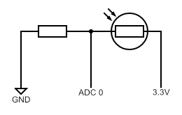
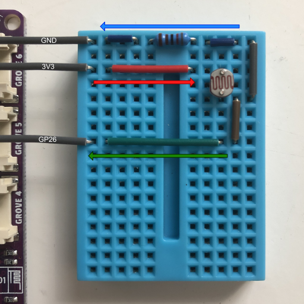

# Pico Synthesiser
## Description
In this task you will make a synthesiser using the PWM and a light dependent resistor. You will need to implement the function `pwm_set_freq(uint32_t freq)` to set the PWM to generate a wave at the given frequency and then create a small circuit to input an adjustable voltage into the ADC.

## Task Classification
MEDIUM

## Help
- [The Pico in C: Basic PWM](https://www.i-programmer.info/programming/hardware/14849-the-pico-in-c-basic-pwm.html)
- [Basic Pico ADC in C](https://www.okdo.com/getting-started/get-started-with-raspberry-pi-pico-gpio-c-c/)

## Making a Potential Divider
### Potential divider circuit using an LDR

### My potential divider

